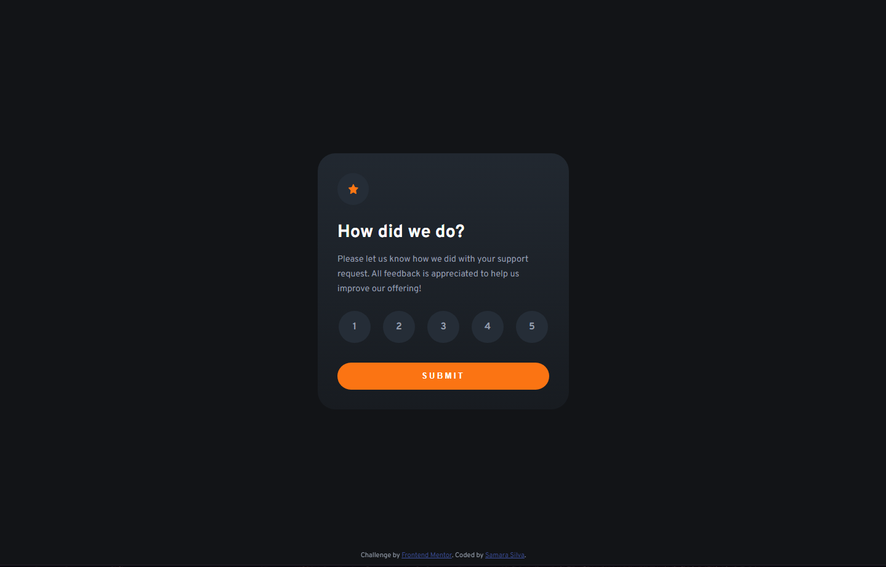
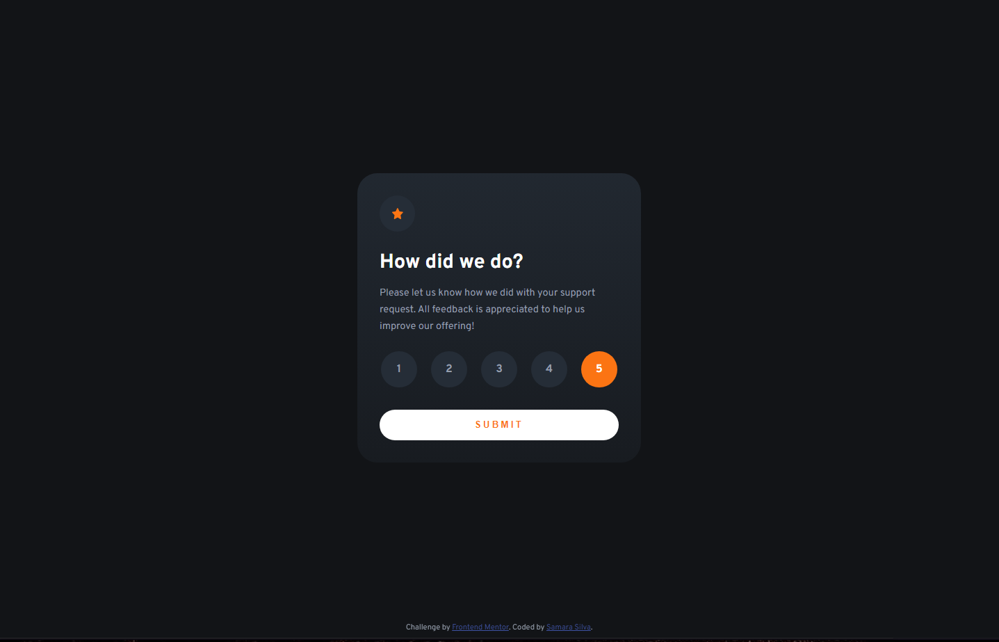
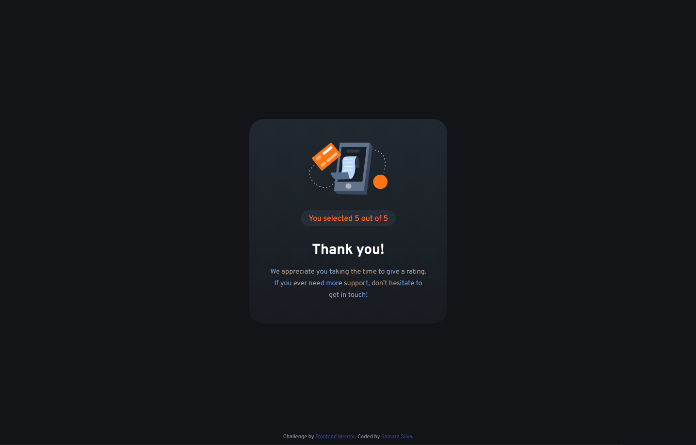
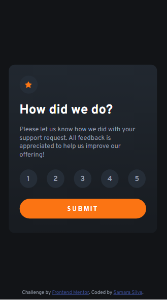
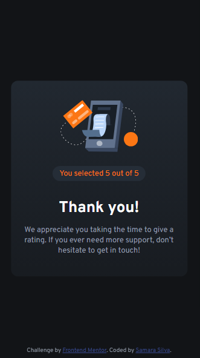

# Frontend Mentor - Interactive rating component solution

This is a solution to the [Interactive rating component challenge on Frontend Mentor](https://www.frontendmentor.io/challenges/interactive-rating-component-koxpeBUmI). Frontend Mentor challenges help you improve your coding skills by building realistic projects. 

## Table of contents

- [Overview](#overview)
  - [The challenge](#the-challenge)
  - [Screenshot](#screenshot)
  - [Links](#links)
- [My process](#my-process)
  - [Built with](#built-with)
  - [What I learned](#what-i-learned)
  - [Continued development](#continued-development)
  - [Useful resources](#useful-resources)
- [Author](#author)

## Overview

In this README I go over my process of development for this challenge, the things I learned and the tools I used trying to get my page as close to the design as possible.

### The challenge

Users should be able to:

- View the optimal layout for the app depending on their device's screen size
- See hover states for all interactive elements on the page
- Select and submit a number rating
- See the "Thank you" card state after submitting a rating

### Screenshot







### Links

- Solution URL: [Solution](https://www.frontendmentor.io/solutions/responsive-solution-using-flexbox-and-css-variables-yxEalMgYTU)
- Live Site URL: [Site](https://samarasilva18.github.io/interactive-rating-component/)

## My process

1. Utilizing a mobile-first workflow once again, I first structured the HTML.
2. Then I applied the CSS in a top-down fashion, working on the body, then the rating container, the star image, the texts, and the buttons.
3. I then hid the rating component and applied CSS to the thank-you component.
4. After that, I hid the thank-you component and created the :hover functionalities for the buttons in the rating component. 
5. I created the functionality that shows the selected rating score in the thank-you component.
6. I then created the functionality that hides the rating or the thank-you component depending on which one needs to be active.
7. Finally, I wrote the README.
8. I uploaded the project on Github.

### Built with

- CSS custom properties
- Flexbox
- Mobile-first workflow

### What I learned

I figured out an interesting way to hide components in CSS through this project, by using display: none and !important ! Coupled with Javascript, it's possible to toggle components "on and off", though in this project the hiding only goes one way!

```css
.inactive {
  display: none !important;
}
```

I thought the whole mechanism to select the score buttons in the rating was pretty cool too! I needed to select all of them, go through them listening for 'clicks', and depending on what the user chooses I save the value of the button in a variable to be used in the thank-you card later!
The most challenging part of this for me was figuring out that I needed to save the previous button the user clicked on (prevBtn) to be able to allow for clicking all of the options with no problems, because the active class of the button will be removed and added depending on which button you click! It's a great function to have for uncertain people that take a good while picking their choices!

```js
const liButton = document.querySelectorAll('.list-button');
    for (let i = 0; i < liButton.length; i++){
    liButton[i].addEventListener('click', (e) => {
      let selectButton = 1;
      let prevBtn = document.querySelector(".active-button");
      if (prevBtn) {
        prevBtn.classList.remove('active-button');
        e.target.classList.add('active-button');
        selectButton = e.target.innerHTML;
      }
      else {
        e.target.classList.add('active-button');
        selectButton = e.target.innerHTML;
      }
      document.getElementById("selected").innerHTML = selectButton;
    });
    }
```

### Continued development

I was wary of this challenge because of the use of JS, but it wasn't too bad! I wish I had used more new tools in this one, but the wariness kept me from it. For future development, I'll attempt to use new tools to learn more about coding even if the challenge involves JS!

### Useful resources

- [How to select multiple buttons?](https://stackoverflow.com/questions/73663568/how-to-select-multiple-buttons-and-keep-the-border-on-each-one-clicked) - This helped me figure out what kind of function I should make to make the score buttons toggable!
- [Get the text of a li element](https://stackoverflow.com/questions/2460706/get-the-text-of-an-li-element) - And this helped me with getting the score from the button picked!

## Author

- Frontend Mentor - [@samarasilva18](https://www.frontendmentor.io/profile/samarasilva18)
- Github - [samarasilva18](https://github.com/samarasilva18)